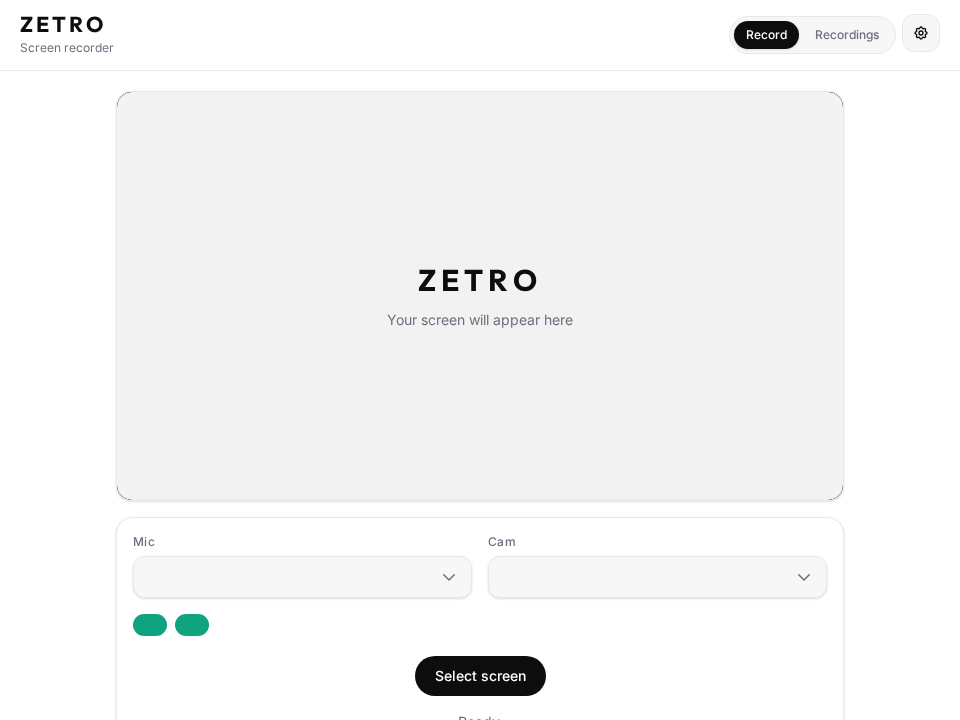
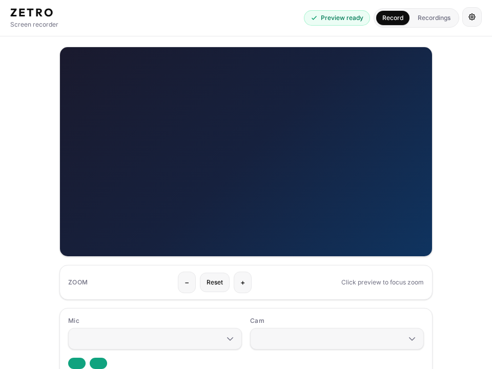
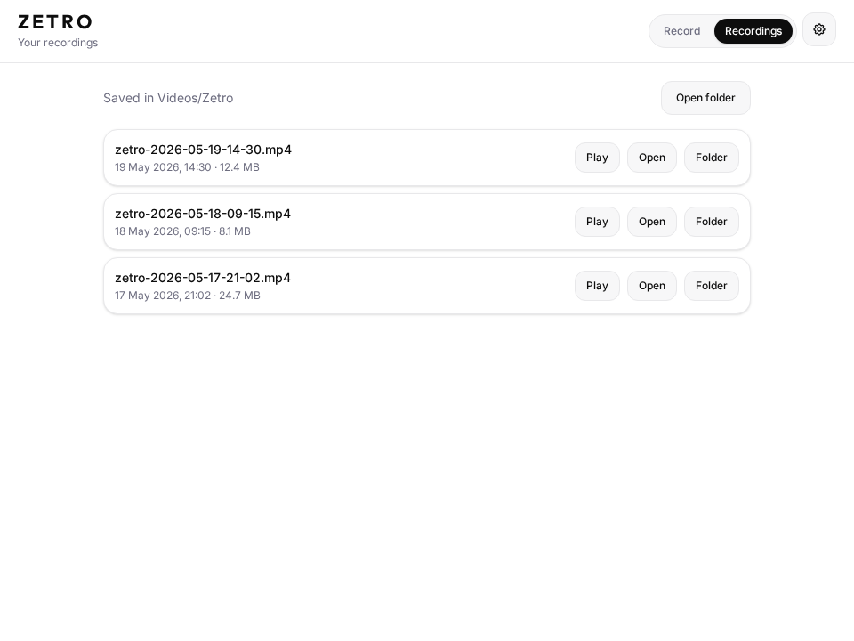
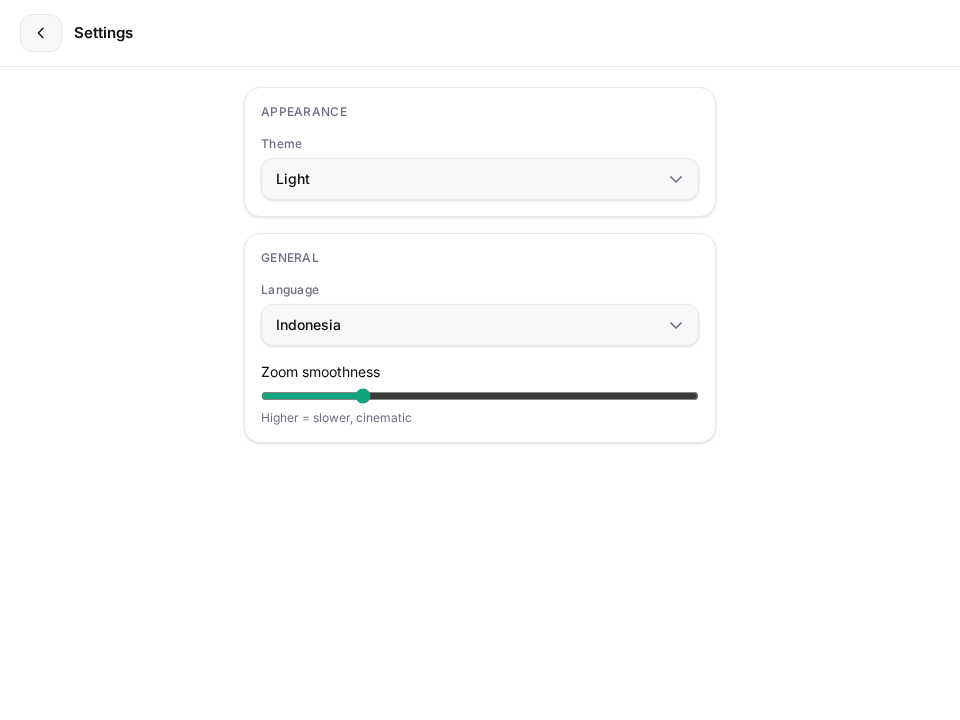
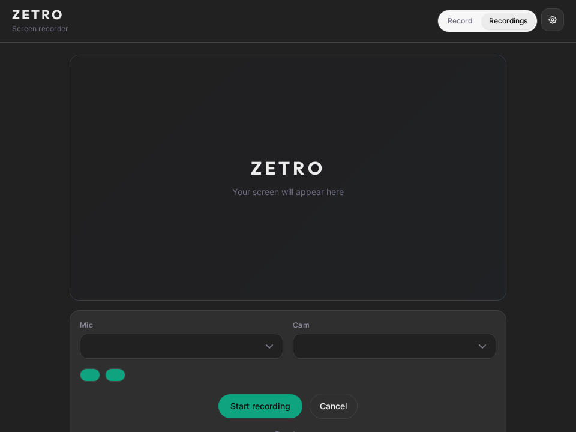

<p align="center">
  
</p>

<h1 align="center">Zetro</h1>

<p align="center">
  Desktop screen recorder for Linux — screen &amp; window capture, microphone, webcam overlay, smooth zoom, and a built-in recordings library.
</p>

<p align="center">
  
</p>

<p align="center">
  <a href="https://github.com/perintisteam/ZETRO/actions/workflows/ci.yml"></a>
  
</p>

<p align="center">
  <a href="#features">Features</a> ·
  <a href="#screenshots">Screenshots</a> ·
  <a href="#setup">Setup</a> ·
  <a href="#usage">Usage</a> ·
  <a href="#development">Development</a> ·
  <a href="#license">License</a>
</p>

## Features

- Screen or window source picker
- Live preview before recording
- Microphone and webcam toggles
- Webcam picture-in-picture overlay
- Smooth zoom controls during recording
- Local recordings library with in-app playback
- English and Indonesian UI
- Light, dark, and system themes
- Automatic playback-safe MP4 conversion with `ffmpeg`

## Screenshots

### Record & preview

|           Idle — ready to pick a screen            |            Preview — verify before you record            |
| :------------------------------------------------: | :------------------------------------------------------: |
|  |  |

### Library & settings

|             Recordings library             |                   Settings                   |
| :----------------------------------------: | :------------------------------------------: |
|  |  |

### Dark theme

<p align="center">
  
</p>

## Requirements

- Node.js 20 or newer
- npm
- Linux desktop environment with screen capture support
- `ffmpeg` for MP4 conversion that opens reliably from Linux file managers

Install `ffmpeg` on Fedora:

```bash
sudo dnf install ffmpeg
```

Install `ffmpeg` on Ubuntu/Debian:

```bash
sudo apt install ffmpeg
```

## Setup

Install dependencies:

```bash
npm install
```

Build the CSS:

```bash
npm run build:css
```

Run the app in development:

```bash
npm run dev
```

## Usage

1. Open Zetro.
2. Choose the microphone and camera options.
3. Select a screen or window.
4. Confirm the preview.
5. Start recording.
6. Stop recording when finished.
7. Open the **Recordings** tab to play, reveal, or fix saved files.

Recordings are saved to:

```text
~/Videos/Zetro
```

## Playback compatibility

Electron's `MediaRecorder` produces WebM during recording. On some Linux systems, file managers and GStreamer try to decode these files as VP8 with alpha metadata and fail with errors such as:

```text
Cannot handle streams without an initial alpha buffer.
```

Zetro mitigates this by converting saved recordings to MP4 with H.264 video and AAC audio when `ffmpeg` is available. If conversion fails or `ffmpeg` is missing, use the Recordings tab and click **Fix playback** after installing `ffmpeg`.

## Project structure

```text
.
├── assets/
│   ├── app.js          # Renderer entry point and UI orchestration
│   ├── i18n.js         # English and Indonesian strings
│   ├── library.js      # Recordings library UI
│   ├── logo.svg        # App logo
│   ├── recorder.js     # Capture, composition, and MediaRecorder logic
│   ├── settings.js     # Theme and language persistence
│   ├── styles.css      # Generated Tailwind CSS
│   └── zoom.js         # Smooth zoom behavior
├── docs/
│   └── screenshots/    # README screenshots
├── main/
│   └── playback.js     # ffmpeg playback-safe conversion helpers
├── scripts/
│   └── capture-screenshots.mjs
├── src/
│   └── input.css       # Tailwind source CSS
├── index.html          # App shell
├── main.js             # Electron main process and IPC handlers
├── preload.js          # Safe renderer bridge
└── package.json
```

## Development

Format and lint before opening a pull request:

```bash
npm run format      # apply Prettier
npm run lint        # format check + main-process syntax check
npm run build:css   # rebuild Tailwind output
```

### CI/CD (GitHub Actions)

| Workflow                       | Trigger                            | What it does                                                                         |
| ------------------------------ | ---------------------------------- | ------------------------------------------------------------------------------------ |
| [CI](.github/workflows/ci.yml) | Push / PR to `main`                | Prettier check, JS syntax check, CSS build, verify `assets/styles.css` is up to date |
| [CD](.github/workflows/cd.yml) | Tag `v*` (e.g. `v1.0.0`) or manual | Builds release bundle and publishes a GitHub Release                                 |

Create a release:

```bash
git tag v1.0.0
git push origin v1.0.0
```

## Scripts

| Command                | Description                                   |
| ---------------------- | --------------------------------------------- |
| `npm run dev`          | Build CSS and start Electron                  |
| `npm run build:css`    | Compile `src/input.css` → `assets/styles.css` |
| `npm run watch:css`    | Watch Tailwind input and rebuild CSS          |
| `npm run format`       | Format code with Prettier                     |
| `npm run format:check` | Check formatting (used in CI)                 |
| `npm run lint`         | Run all lint checks                           |
| `npm run screenshots`  | Regenerate README screenshots                 |

To refresh screenshots after UI changes:

```bash
npm install --no-save playwright@1.52.0
npx playwright install chromium
npm run screenshots
```

## License

Zetro is licensed under the MIT License. See [LICENSE](./LICENSE).
